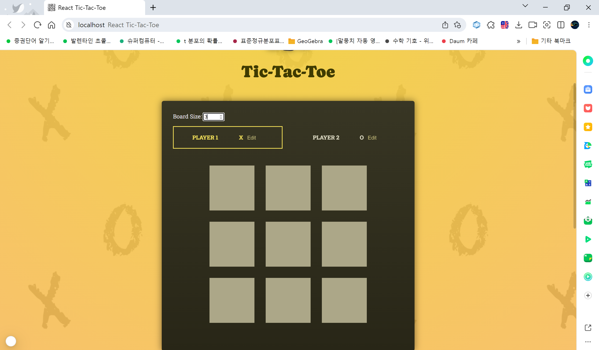

# react-project-2

A self-playing tic-tac-toe game made of react. A tic-tak-toe is simply a game of making a bingo before anyone else does at one gameboard. Each mark is characterized by the player who placed it. Each player could mark an unmarked cell of the square gameboard. The first player whose mark makes up a bingo (horizontally, vertically, or diagonally) wins the game. The game is draw if there is no bingo and every cell is marked. Currently (25/01/15-), this supports 3-10 (arbitrarily set maximum) board size. (Although it works, note that 5-10 sized gameboards 'overflows' the game container.)

## Getting Started

These instructions will get you a copy of the project up and running on your local machine for development and testing purposes. See deployment for notes on how to deploy the project on a live system.

### Prerequisites

<!-- What things you need to install the software and how to install them -->

- git
- next.js

Note: For Windows users, it is better if you have and run the next.js installed in your local machine instead of WSL, for developing purposes. Unlike WSL's, this enables real-time reloads in running the development server and editing the programs. (at least in the author's Windows 11 OS.)

<!-- ```
Give examples
``` -->

### Installing

A step by step series of examples that tell you how to get a development env running

#### 1. Copy the project

```bash
git clone https://github.com/calculus0129/react-project-2.git
```

#### 2. Install necessary files to run the program

```bash
npm install
```

#### 3. Run the development server

```bash
npm run dev
# or
yarn dev
# or
pnpm dev
# or
bun dev
```

Open [http://localhost:3000](http://localhost:3000) with your browser to see the result.



You can start editing the page by modifying `app/page.tsx`. The page auto-updates as you edit the file.

This project uses [`next/font`](https://nextjs.org/docs/app/building-your-application/optimizing/fonts) to automatically optimize and load [Geist](https://vercel.com/font), a new font family for Vercel.

<!-- Say what the step will be

```
Give the example
```

And repeat

```
until finished
```

End with an example of getting some data out of the system or using it for a little demo -->

<!-- ## Running the tests

Explain how to run the automated tests for this system

### Break down into end to end tests

Explain what these tests test and why

```
Give an example
```

### And coding style tests

Explain what these tests test and why

```
Give an example
``` -->

## Deployment

Add additional notes about how to deploy this on a live system

### Deploy on Vercel

The easiest way to deploy your Next.js app is to use the [Vercel Platform](https://vercel.com/new?utm_medium=default-template&filter=next.js&utm_source=create-next-app&utm_campaign=create-next-app-readme) from the creators of Next.js.

Check out our [Next.js deployment documentation](https://nextjs.org/docs/app/building-your-application/deploying) for more details.

## Built With

<!-- - [Dropwizard](http://www.dropwizard.io/1.0.2/docs/) - The web framework used
- [Maven](https://maven.apache.org/) - Dependency Management
- [ROME](https://rometools.github.io/rome/) - Used to generate RSS Feeds -->

This is a [Next.js](https://nextjs.org) project bootstrapped with [`create-next-app`](https://nextjs.org/docs/app/api-reference/cli/create-next-app).

<!-- ## Contributing

Please read [CONTRIBUTING.md](https://gist.github.com/PurpleBooth/b24679402957c63ec426) for details on our code of conduct, and the process for submitting pull requests to us. -->

<!-- ## Versioning

We use [SemVer](http://semver.org/) for versioning. For the versions available, see the [tags on this repository](https://github.com/your/project/tags). -->

## Authors

- **Jaehyun Bhang** - _working with TypeScript and linting_ - [ryanbhang129](https://github.com/calculus0129)

See also the list of [contributors](https://github.com/calculus0129/react-project-2/contributors) who participated in this project.

## License

This project is licensed under the MIT License - see the [LICENSE](LICENSE) file for details.

## Acknowledgments

- Awesome README.md template: https://gist.github.com/PurpleBooth/109311bb0361f32d87a2

<!-- * Hat tip to anyone whose code was used
- Inspiration
- etc -->

## Learn More

To learn more about Next.js, take a look at the following resources:

- [Next.js Documentation](https://nextjs.org/docs) - learn about Next.js features and API.
- [Learn Next.js](https://nextjs.org/learn) - an interactive Next.js tutorial.

You can check out [the Next.js GitHub repository](https://github.com/vercel/next.js) - your feedback and contributions are welcome!
